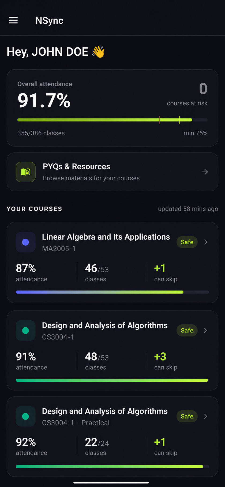
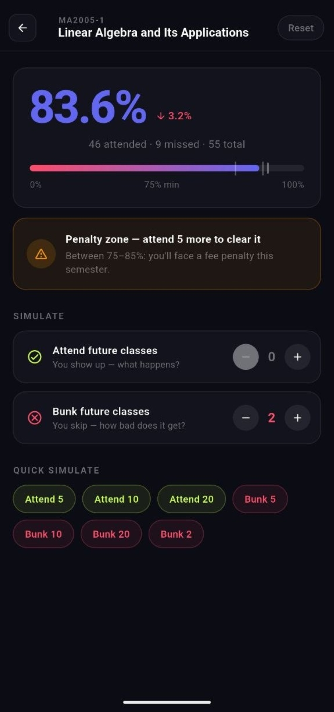
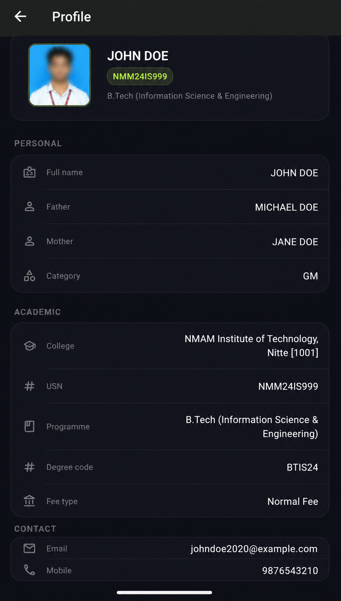
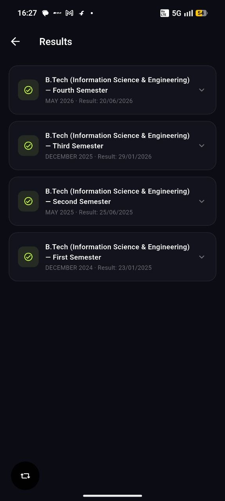
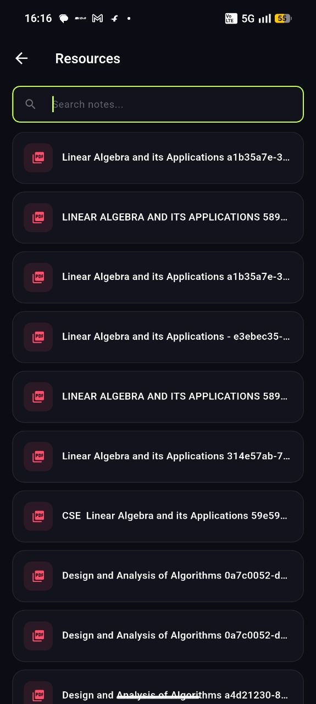

# NSync: Attendance tracker

A Flutter application that helps students monitor attendance, identify attendance risks early, and plan corrective actions to remain compliant with institutional attendance requirements.

## Purpose

This app helps students monitor their attendance, predict risk of "defaulting" (falling below required attendance thresholds), and suggest concrete actions to stay compliant. Rather than encouraging skipping classes, the app's goal is to support better planning, timely reminders, and data-driven decisions that prevent attendance shortfalls.

## Key Features

- Track attendance per course with customizable required percentage thresholds.
- Visualize current attendance, trends, and projected outcomes based on upcoming classes.
- Receive alerts when attendance is at risk and actionable suggestions (e.g., attend extra sessions, request make-up classes).
- Optimize schedule decisions by showing which classes to prioritise to restore compliance quickly.
- Export simple reports and summaries to share with advisors or tutors.
- Works offline with on-device storage and optional calendar integration for reminders.

## How the App Helps Prevent Defaulting

- Risk detection: the app computes your projected attendance and highlights courses that may fall below the required minimum.
- Action planning: it suggests the minimum number of classes you must attend (or avoid missing) to remain compliant.
- Prioritization: when schedules conflict, the app indicates which classes have higher urgency so you can make informed choices.
- Timely reminders: configurable notifications reduce accidental absences and help you stick to your plan.

## Screenshots Preview

| Dashboard Overview | Course Analytics & Details | Profile & Portal Info |
| :---: | :----: | :---: |
|  |  |  |

| Exam Results Analytics | Shared Study Materials |
| :---: | :---: |
|  |  |

---

## Quick Start (development)

Prerequisites: install the Flutter SDK (stable channel) and set up an emulator or connect a device.

```bash
flutter pub get
flutter run
```

## Privacy

All attendance data is stored locally on the device by default. No data is transmitted unless you explicitly export or share reports.

## Creators

* **[P Devdat](https://github.com/devdat2021)**
* **[Pramukh Nayak](https://github.com/pramukhnayak7)**


## Contributing

Contributions are welcome: bug reports, feature requests, and PRs that improve the app's usefulness for maintaining attendance compliance.

## Disclaimer / Credit

NSync is an independent student-developed tool designed to help users monitor and manage attendance. It is not affiliated with, endorsed by, or officially associated with **NMAM Institute of Technology (NMAMIT)** or any university administration unless explicitly stated.

The application is intended solely for personal attendance tracking, planning, and compliance monitoring. Users are responsible for ensuring their use of the application complies with applicable institutional policies and terms of service.

NSync does not modify academic records, alter attendance data, or interfere with institutional systems. The application only presents attendance information available to the authenticated user and provides analytical tools to help users maintain attendance requirements.

